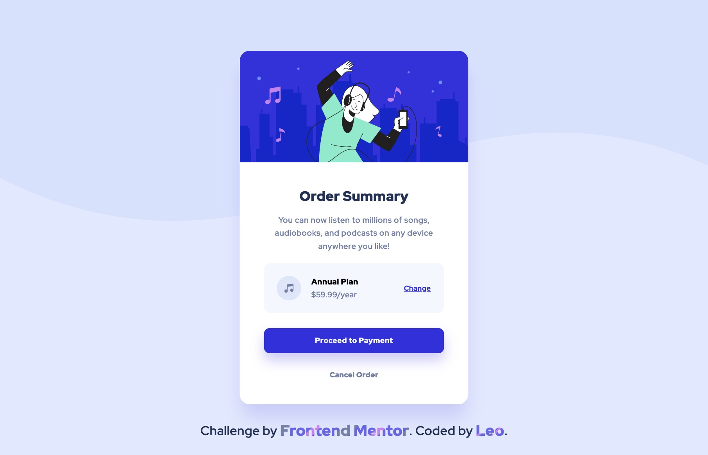

# Frontend Mentor - Order summary card solution

This is a solution to the [Order summary card challenge on Frontend Mentor](https://www.frontendmentor.io/challenges/order-summary-component-QlPmajDUj). Frontend Mentor challenges help you improve your coding skills by building realistic projects. 

## Table of contents

- [Overview](#overview)
  - [The challenge](#the-challenge)
  - [Screenshot](#screenshot)
  - [Links](#links)
- [My process](#my-process)
  - [Built with](#built-with)
  - [What I learned](#what-i-learned)
  - [Continued development](#continued-development)
  - [Useful resources](#useful-resources)
- [Author](#author)

## Overview

### The challenge

Users should be able to:

- See hover states for interactive elements

### Screenshot



### Links

- Solution URL: [Solution URL](https://www.frontendmentor.io/solutions/order-summary-component-challenge-solution-using-float-only-K3aTK70CpG)
- Live Site URL: [Live site URL](https://leo-code-ca.github.io/order-summary-component/)

## My process

### Built with

- Semantic HTML5 markup
- CSS custom properties
- CSS float only (no flexbox, no CSS grid)

### What I learned

For this project, I decided to challenge myself with the rule of building this order summary WITHOUT using CSS grid or flexbox! That’s what I did and instead, I only used CSS float. It was neither the easiest nor the fastest way to build the project but I'm glad I did it that way because I’ve really started to get used to flexbox and CSS grid and even if those are amazing tools, I still want to be able to achieve what I want differently. 

```css
.change {
    float: left;
}

.payment {
    clear: left;
}
```

I also tried to be even more accurate, about the dimensions of the different elements I styled, that I've been in my previous "reproduction" projects. It took me a lot of time and I'm not sure yet if it was worth the effort but I’m glad I experimented that.

```css
.payment {
    height: 49px;
}

.bottom {
    padding: 3.8rem 2.4rem 3.7rem;
    height: 407px;
}
```

Finally, I'm pretty happy of my box-shadows! I find them really hard to reproduce, especially when their opacity is very low so it's hard to see them very clearly but I still find the result decent.

```css
.payment {
    box-shadow: 0px 15px 25px var(--b-b-tranparent1);
}
```

### Continued development

I worked on a fun animation for the attribution paragraph. I definitively love gradients and I absolutely want to become better at creating them! About the animation itself, I first tried to kinda overlay my paragraph with another one which was totally similar. My idea was to apply a gradient on the second paragraph that overlays the first one and then create an animation which sets the width of this paragraph from 0 to 100%. To be honest it didn't work very well at all. 

Then, I gave up the idea of creating two similar paragraphs and I kept only one. I discovered that the background size property is animatable! I tried it and it worked! Actually it’s way more straight forward than my first idea! I definitely need to become more knowledgeable on animatable properties, it would save me lots of time!

I think I also need to learn how to create better classes. When I say better, I mean more efficient, more reusable, more understandable. I'm not sure if there is a single good method to do that (if yes, I haven't found it yet!) but I try to improve myself on every project I build. My goal is to think about the classes I'd like to create before starting to code. Actually, I always end up modifying some of them along the way…

### Useful resources

- [Correct HTML semantics](https://www.tutorialspoint.com/Which-HTML5-tags-are-more-appropriate-to-represent-money-amount#:~:text=If%20you%20want%20to%20emphasise,with%20a%20class.) - This article helped me to understand better what kind of HTML elements should be used to represent money amounts. It's really useful because before reading it, I didn’t have a clue what to use!

## Author

- Frontend Mentor - [@Leo-Code-CA](https://www.frontendmentor.io/profile/Leo-Code-CA)
- FreeCodeCamp - [@Leo-code](https://www.freecodecamp.org/Leo-code)


